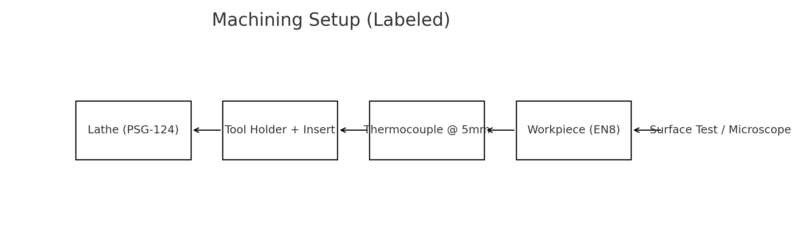

# Bachelor-FinalYear-Project
Bachelor Thesis
# 🌿 EcoMachining
### *Performance Assessment of Additive-Based Vegetable Oils as Cutting Fluids in Machining*

This project explores the formulation and application of **biodegradable cutting fluids** derived from **coconut oil and sunflower oil** blended with **maize starch additives**. It compares their cooling, lubricating, and tribological properties against conventional fluids during **EN8 steel machining under Minimum Quantity Lubrication (MQL)**.

---

## 🧪 Objective
To evaluate the machining performance of vegetable oil–based cutting fluids enhanced with maize starch additives in terms of:
- Thermal conductivity
- Cutting temperature
- Tool wear
- Surface roughness

---

## ⚙️ Experiment Setup
| Parameter | Specification |
|------------|---------------|
| Work Material | EN8 Steel |
| Machine | PSG-124 Lathe |
| Operation | Turning |
| Tool | CNMG120408NC6110 Carbide |
| Feed | 0.17 mm/rev |
| Speed | 560 rpm |
| Depth of Cut | 0.5 mm |
| Flow Rate | 10 ml/min (MQL) |

---

## 🧫 Cutting Fluid Formulations
| Base Oil | Additive (Maize Starch) | Concentration |
|-----------|--------------------------|----------------|
| Coconut Oil | 0.1g, 0.5g, 1.0g per 100ml | |
| Sunflower Oil | 0.1g, 0.25g, 0.5g per 100ml | |

All fluids were **ultrasonically homogenized** to ensure uniform dispersion and stability.

---

## 📈 Key Findings
- **Coconut Oil + 0.1g starch per 100ml** provided **best performance** in reducing cutting temperature and tool wear.
- **Sunflower Oil variants** showed superior **surface finish** due to better lubricity.
- All bio-fluids demonstrated **higher thermal conductivity** than pure oils, validating their **eco-friendly efficiency**.

---

## 🌍 Sustainability Impact
The study supports **green manufacturing** initiatives by reducing:
- Toxic emissions
- Operator health hazards
- Non-biodegradable waste

The results suggest a feasible replacement for mineral-based cutting fluids with **renewable, plant-derived alternatives**.

---

## 🧮 Visual Insights

---

## 📊 Data Overview
| Property | CC + 0.1g | SF + 0.1g | CC + 0.5g | SF + 0.25g |
|-----------|------------|------------|------------|-------------|
| Thermal Conductivity (W/m-K) | 0.26 | 0.232 | 0.245 | 0.241 |
| Tool Wear (µm) | 144.6 | 137 | 81.9 | 152 |
| Surface Roughness (µm) | 0.85 | 0.72 | 0.67 | 0.75 |

---

## 🧰 Tools Used
- **P.A. Hilton Thermal Conductivity Apparatus**
- **Digital Temperature Indicator (K-Type Thermocouple)**
- **Surf Test SJ-301**
- **SC30 Optical Microscope**
- **UV Spectrometer**

---

## 🧑‍🔬 Authors
- **P. Shiva Kumar**  
- **T. Sai Mahith**  
- **N. Sai Kiran**  
- **T. Sita Rama Raju**  
Under the guidance of **Dr. R. Padmini**, Assistant Professor, Department of Industrial Engineering, GITAM University.

---

## 📚 Citation
> Shiva Kumar P., Mahith T., Kiran N., Raju T.S.R., Padmini R. (2017). *Performance Assessment of Additive-Based Vegetable Oils as Cutting Fluids in Machining*. GITAM University, Visakhapatnam.

---

## 🪴 Future Scope
- Extend the study with **nanoparticle-infused biofluids**
- Test under **multi-axis CNC machining**
- Integrate **IoT sensors** for real-time monitoring of tool wear and temperature

---

## 🏁 License
Licensed under the MIT License.  
Feel free to use, modify, and cite with proper attribution.

---

## 🧠 Keywords
`Bio-degradable Fluids` `MQL` `Vegetable Oil` `Maize Starch` `Machining Performance` `Sustainable Manufacturing`
