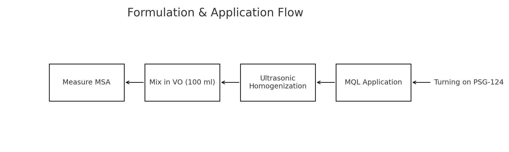
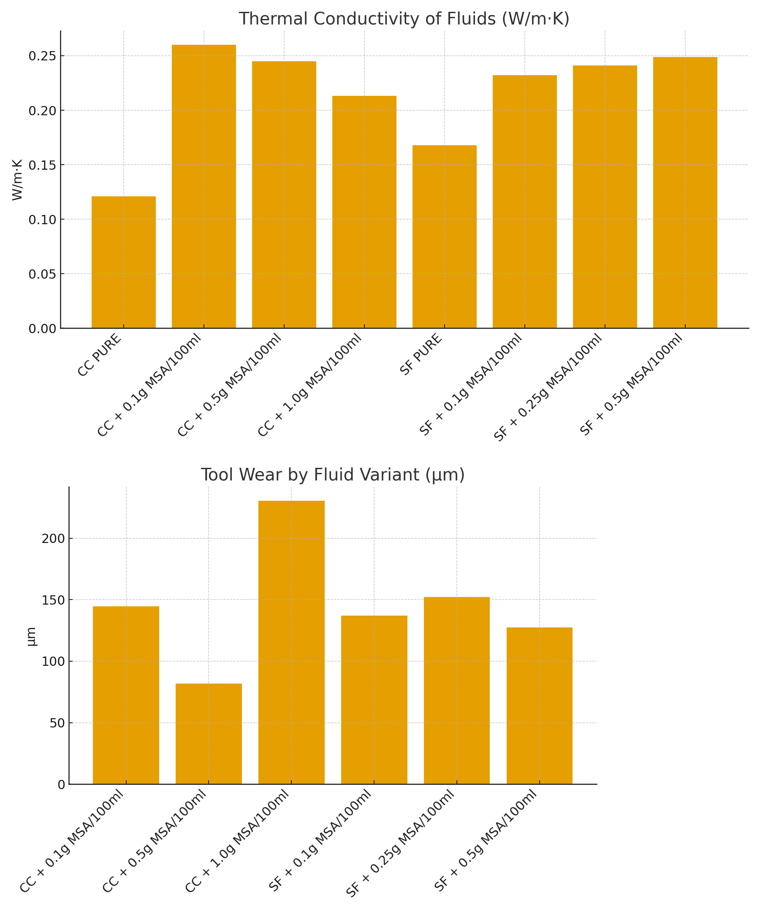

  

# 🎓 Echo Mcahining -Bachelor-FinalYear-Project  
### *EcoMachining – Performance Assessment of Additive-Based Vegetable Oils as Cutting Fluids in Machining*

> **B.Tech Final Year Project (2017)**  
> Department of Mechanical Engineering, GITAM University, Visakhapatnam  
> **Author:** P. Shiva Kumar  
> **Guide:** Dr. R. Padmini (Assistant Professor, Industrial Engineering)

---

## 🧩 Project Overview
**EcoMachining** focuses on developing **biodegradable cutting fluids** made from **coconut oil (CC)** and **sunflower oil (SF)** blended with **maize starch additives (MSA)**.  
The study evaluates their performance in **turning EN8 steel** under **Minimum Quantity Lubrication (MQL)** and compares results with conventional cutting fluids in terms of thermal and tribological efficiency.

---

## 📁 Repository Structure

**Project Directory**
- `README.md`  
- `references.md`  
- `thesis_report.docx`  
- `thesis_report_summary.pdf`  

**experiment/**
- `formulation_diagram.png`  
- `machining_setup.png`  
- `mql_system_schematic.png`  
- `material_composition_table.csv`  
- `en8_mechanical_properties.csv`  

**results/**
- `thermal_conductivity.csv`  
- `tool_wear_data.csv`  
- `cutting_temperatures_coconut.csv`  
- `cutting_temperatures_sunflower.csv`  
- `thermal_conductivity_bar.png`  
- `tool_wear_bar.png`  
- `graphs.png`  

**simulation/**
- `thermal_analysis.ipynb`  
- `wear_rate_visualization.ipynb`  

---

## ⚙️ Experiment Setup

| Parameter | Specification |
|------------|---------------|
| Work Material | EN8 Steel (080M40) |
| Machine | PSG-124 Lathe |
| Operation | Turning |
| Cutting Tool | CNMG120408NC6110 (Carbide) |
| Feed | 0.17 mm/rev |
| Speed | 560 rpm |
| Depth of Cut | 0.5 mm |
| Lubrication | MQL @ 10 ml/min |
| Fluids | Coconut & Sunflower Oils + Maize Starch (0.1–1.0 g per 100 ml) |

---

## 🧪 Methodology

**Formulation & Testing Steps**
1. Mix maize starch powder in vegetable oils (CC & SF) at selected concentrations.  
2. Ultrasonically homogenize for 60 minutes for uniform dispersion.  
3. Apply under **MQL system** during EN8 turning operation.  
4. Measure:
   - Thermal Conductivity  
   - Cutting Temperature  
   - Tool Wear  
   - Surface Roughness  

   
  <i>Flowchart of Additive Preparation & Machining Application</i>

---

## 📊 Experimental Data

### 🔹 Thermal Conductivity (W/m·K)
| Fluid | Thermal Conductivity |
|--------|----------------------|
| CC PURE | 0.121 |
| CC + 0.1g | 0.260 |
| CC + 0.5g | 0.245 |
| CC + 1.0g | 0.213 |
| SF PURE | 0.168 |
| SF + 0.1g | 0.232 |
| SF + 0.25g | 0.241 |
| SF + 0.5g | 0.249 |

### 🔹 Tool Wear (µm)
| Fluid | Tool Wear |
|--------|-----------|
| CC + 0.1g | 144.64 |
| CC + 0.5g | 81.92 |
| CC + 1.0g | 230.40 |
| SF + 0.1g | 136.96 |
| SF + 0.25g | 152.32 |
| SF + 0.5g | 127.35 |

   
  <i>Comparative Results: Thermal Conductivity & Tool Wear</i>

---

## 📈 Analysis & Notebooks
- `simulation/thermal_analysis.ipynb` → Visualizes thermal conductivity and cutting temperatures.  
- `simulation/wear_rate_visualization.ipynb` → Bar chart comparison of tool wear data.  

Datasets are stored in `/results/` and can be analyzed using **Python (Matplotlib + Pandas)**.

---

## 🧭 Key Findings

✅ **Coconut Oil + 0.1g maize starch per 100ml** showed:
- Lowest **cutting temperature**
- Minimum **tool wear**
- Improved **surface finish**

✅ **Sunflower Oil** demonstrated:
- Better **lubricity** and **surface smoothness**

✅ **Overall Outcome:**
- Additives improved **thermal conductivity** and **machining performance**
- All bio-fluids outperformed **dry machining** and **pure oils**

---

## 🌱 Sustainability Impact
This research supports **sustainable manufacturing** by promoting:
- Biodegradable, non-toxic lubricants  
- Reduced operator health hazards  
- Lower environmental impact  

---

## 📚 References
See [`references.md`](references.md) for full academic citations.

---

## 🧾 Citation
> P. Shiva Kumar, T. Sai Mahith, N. Sai Kiran, T. Sita Rama Raju, R. Padmini (2017).  
> *Performance Assessment of Additive-Based Vegetable Oils as Cutting Fluids in Machining.*  
> Department of Mechanical Engineering, GITAM University, Visakhapatnam.

---

## 🪴 License
Licensed under the **MIT License** — free to reuse and modify with proper credit.

---

## 🚗 Project Tagline
| 🧪 [**B.Tech Final Year Project**](https://github.com/ShivaKPuppala/Bachelor-FinalYear-Project) | Academic Research | EcoMachining – Performance Assessment of Additive-Based Vegetable Oils as Cutting Fluids in Machining | EN8 Steel, PSG-124 Lathe, MQL, Coconut & Sunflower Oils, Maize Starch Additive, Thermal & Tribological Testing |
